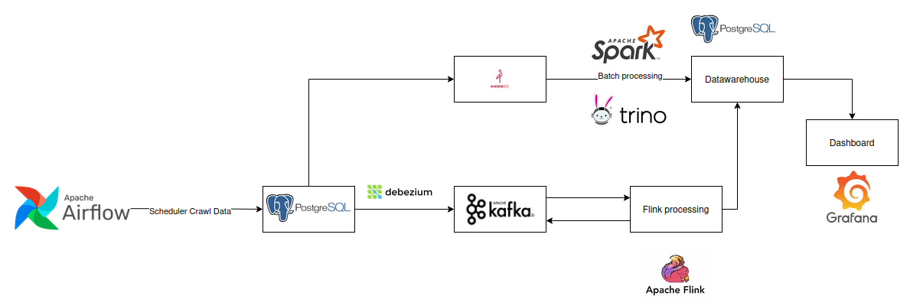

# Overall Architecture



# How-to Guide

## Install

```shell
conda create -n dl python==3.11
conda activate dl
pip install -r requirements.txt
```

## Start our data lake infrastructure

```shell
docker compose -f docker-compose.yml up -d
```

## Generate data and push them to MinIO

### 1. Generate data in delta lake format

```shell
python datalake/utils/crawl_data.py
```

### 2. Upload data to MinIO

```shell
python datalake/utils/export_data_to_datalake.py
```

### 3. Learn more about delta lake

Please follow the comments in the script `utils/investigate_delta_table.py`

```shell
python datalake/utils/investigate_delta_table.py
```

**Note:** Don't forget to install dependencies from `requirements.txt` first.

## Create data schema

After putting your files to `MinIO`, please execute `trino` container by the following command:

```shell
docker exec -ti datalake-trino bash
```

When you are already inside the `trino` container, typing `trino` to in an interactive mode.

After that, run the following command to register a new schema for our data:

```sql

CREATE SCHEMA IF NOT EXISTS lakehouse.bus_data
WITH (location = 's3://bus-data/');

CREATE TABLE NOT EXISTS lakehouse.bus_data.sensor_data (
    stopId VARCHAR,
    countryIso VARCHAR,
    countryUrl VARCHAR,
    stopName VARCHAR,
    stopTypeGroup VARCHAR,
    stopLat DOUBLE,
    stopLon DOUBLE,
    stopDesc DOUBLE,
    datetime VARCHAR,
    tags VARCHAR,
    carbon_monoxide DOUBLE,
    carbon_dioxide DOUBLE,
    nitrogen_dioxide DOUBLE,
    sulphur_dioxide DOUBLE,
    uv_index_clear_sky DOUBLE,
    uv_index DOUBLE,
    temperature_2m DOUBLE,
    relative_humidity_2m DOUBLE,
    precipitation DOUBLE,
    windspeed_10m DOUBLE,
    winddirection_10m DOUBLE
) WITH (
    location = 's3://bus-data/sensor-data'
);

```

**Note:** You can also execute the above command directly in `DBeaver` without executing into the `trino` container.
